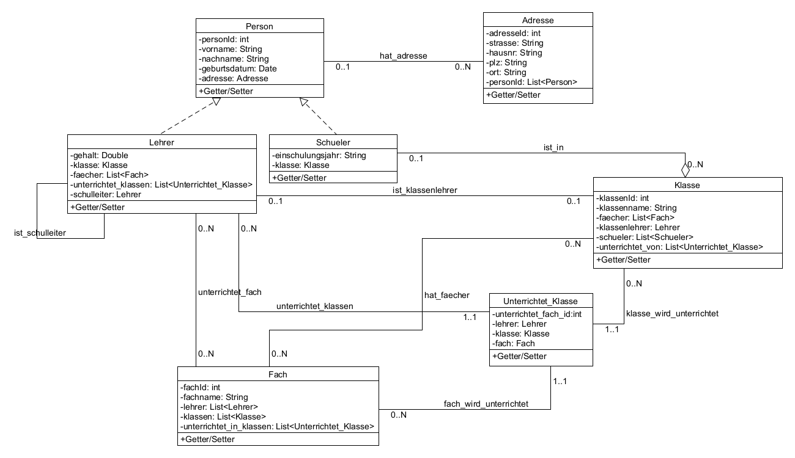

# JPA Demo-Projekt für das Modul „Projekt-Seminar: Integration von Datenbanksystemen“
Wir haben ein JPA Demo-Projekt erstellt für das Modul "Projekt-Seminar: Integration von Datenbankensystemen". 
Wir sollten eine Hausarbeit über "Datenbankzugriffe und Query-Sprachen: SQL vs. JPQL" schreiben. 
Mit diesem Demo-Projekt wollten wir ausprobieren, wie man ein JPA-Projekt aufsetzt und was JPA alles kann. 
Dazu haben wir ein semantisches- und ein logisches Datenbankschema in dem Programm DB-Main (11.0.2) erstellt. Die zugehörige Datei heißt "schema.lun". 

## UML-Klassendiagramm

